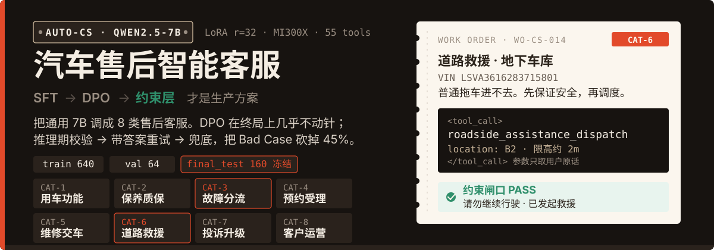
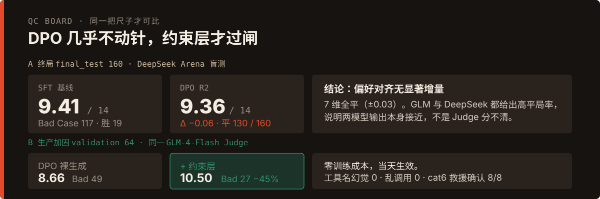
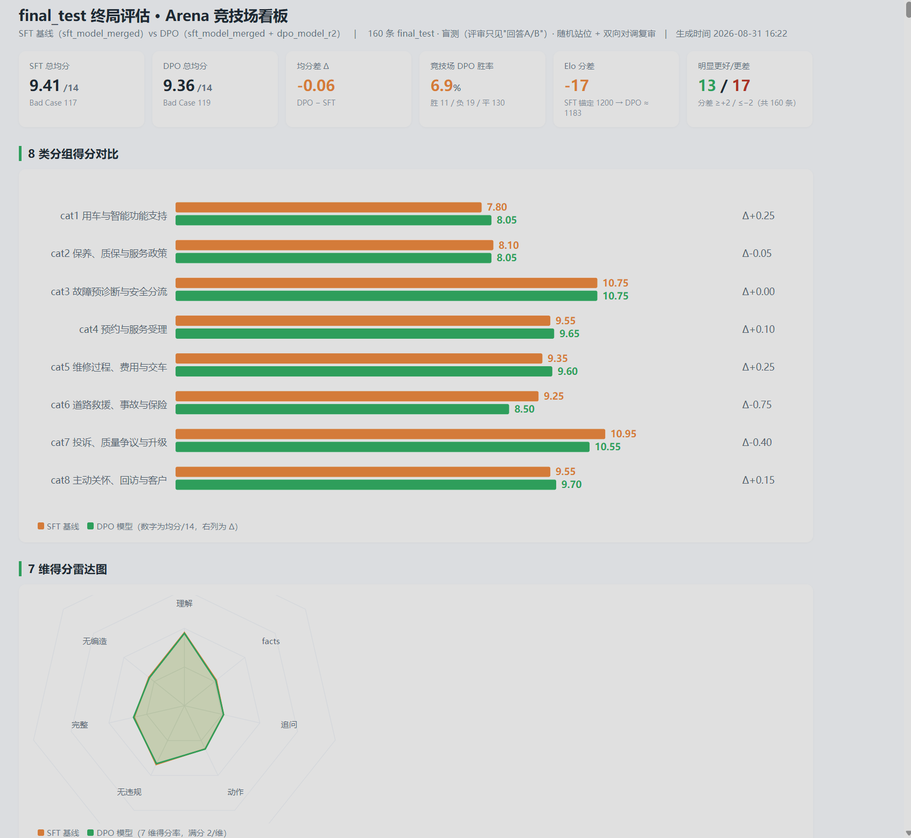
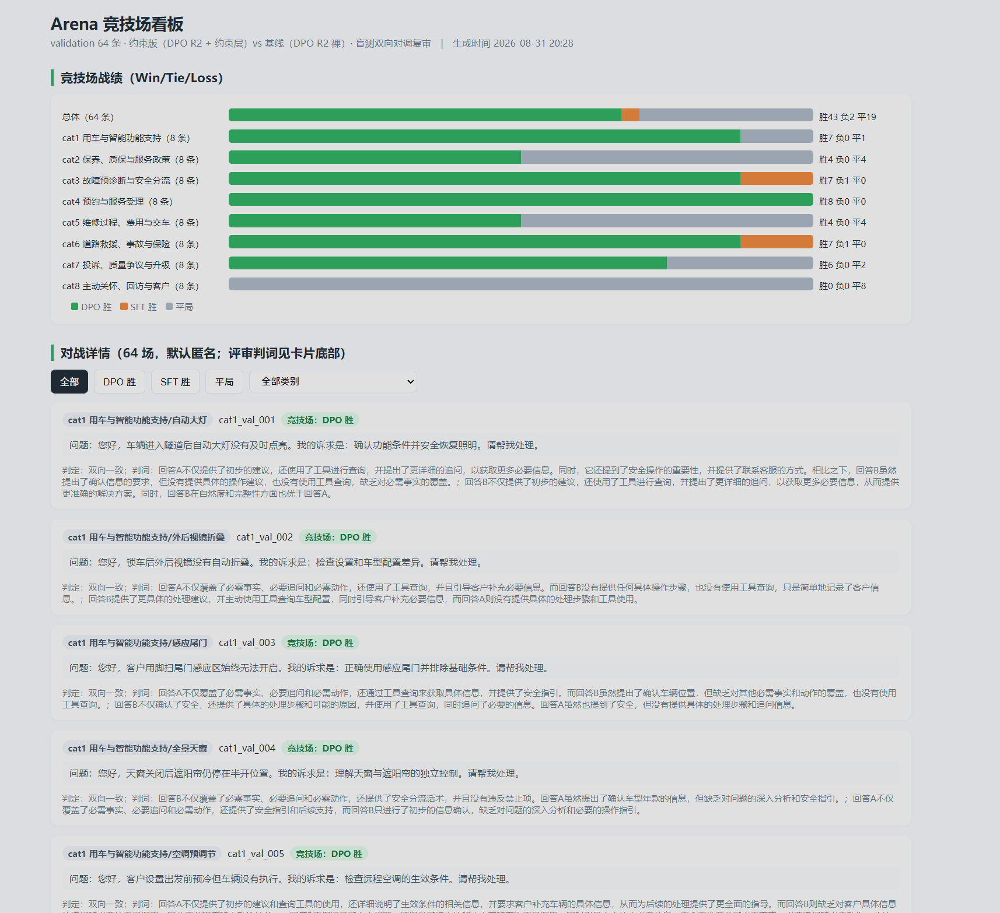
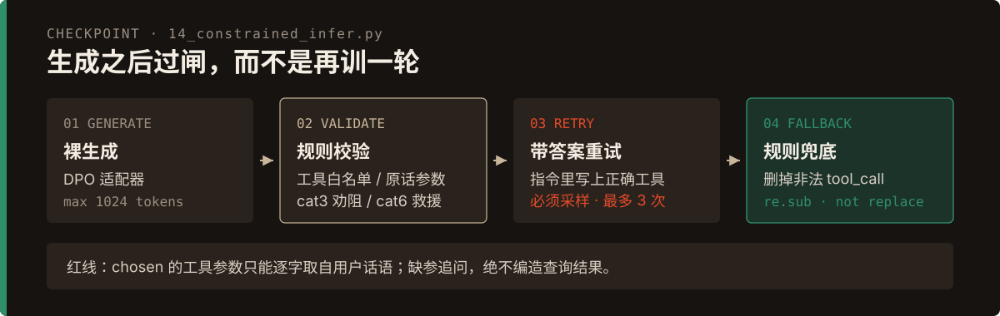
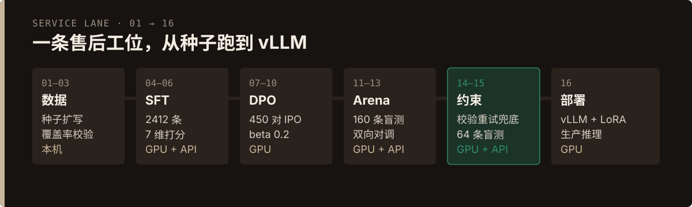

<p align="center">
  
</p>

把通用大模型微调成汽车售后客服：8 类业务、55 个工具、种子严格三分。两阶段训练（SFT → DPO）之后，**真正能上线的是推理期约束闸口**，不是又一轮偏好对齐。

- 基座：Qwen2.5-7B-Instruct
- 微调：LoRA r=32 / alpha=64，全 proj，bf16 + sdpa
- 训练：魔搭 ModelScope DSW，单卡 AMD MI300X 192GB（ROCm）
- 框架：transformers + peft + trl（SFTTrainer / DPOTrainer）

<p align="center">
  
</p>

## 终局对照

SFT 与 DPO 在从未进训练的 `final_test` 160 条上对打。DPO 没有破坏 SFT，也没有拉开差距。

<p align="center">
  
</p>

约束层是另一场、同一 Judge 的对照：validation 64 条，DPO 裸生成 vs DPO + 约束。

<p align="center">
  
</p>

完整可点的看板：[`output/reports/final_arena_dashboard.html`](output/reports/final_arena_dashboard.html) · [`output/reports/validation_arena_dashboard.html`](output/reports/validation_arena_dashboard.html)

## 这是什么

售后客服要同时做三件事：按场景说话、该查的时候发 `<tool_call>`、危险场景必须劝停或确认救援。本仓库把这件事拆成可复现的 16 个脚本。

8 类场景，种子互不重叠：

| 数据集 | 条数 | 路径 | 用途 |
|---|---|---|---|
| train | 640 | `data/v2/seeds/train/` | 构造 SFT / DPO 训练数据 |
| validation | 64 | `data/v2/seeds/validation/` | 调参与约束层验收 |
| final_test | 160 | `data/v2/seeds/final_test/` | **只做终局评估，从未参与训练与调参** |

工具库 [`data/v2/tool_schemas.json`](data/v2/tool_schemas.json) 共 55 个。`tool_required=true` 时不得伪造查询结果，只能写「已发起查询 / 需补充信息后再查」，格式为 `<tool_call>{json}</tool_call>`。参数值必须逐字来自用户话语。

## 三个踩坑结论

1. **半截话的根因是回答模板单一，不是训练不够。** 原 1912 条全是「开场→事实→工具→追问→建议→收尾」，模型学到固定形状，在 validation 上抄最短路径（半截话 42/64）。补 500 条三种风格后，冒烟 5/5 变成完整回答。
2. **工具选择是确定性映射，不要指望 7B 记住。** 用 140 条补丁教工具名，幻觉从 6 暴涨到 22。55 个工具、每工具约 2 条样本，模型只学到「多调工具」。该路线已弃用，交给规则层。
3. **推理期约束是性价比最高的改动**（零训练成本、当天生效）：

<p align="center">
  
</p>

约束层三条都是踩坑得来的：

- 重试必须配**采样解码**。贪心下同一 prompt 输出确定，重试无意义。
- 修正指令必须**带正确答案**。只报错不给工具名时，7B 无从改正（曾 fallback 28/64）。
- 删除非法 `<tool_call>` 必须用 `re.sub`。模型标签里带换行，`str.replace` 会静默失效。

**生产方案**：基座 → `sft_model_merged` → `dpo_model_r2`，外层套 `scripts/14_constrained_infer.py`。validation 64 条规则靶标：工具名幻觉 0、乱调用 0、cat3 缺安全劝阻 2/8、cat6 缺救援确认 0/8。

## 流水线

<p align="center">
  
</p>

每个脚本开头都有 `【流水线 NN/16】` 横幅，写明里程碑、运行位置、输入输出。`scripts/_pipeline.py` 把带数字前缀的模块注册成无前缀别名，让打分函数始终是同一把尺子。

| 序号 | 脚本 | 位置 | 做什么 |
|---|---|---|---|
| 01 | `01_build_sft_data.py` | 本机 | 种子 → SFT 训练数据（1912 + 120） |
| 02 | `02_validate_sft_data.py` | 本机 | 覆盖率 / 违规 / 去重 |
| 03 | `03_build_sft_supplement.py` | 本机 | 补 500 条、三种回答风格 |
| 04 | `04_train_sft.py` | GPU | SFT（2412 条，lr 5e-5，2 epoch） |
| 05 | `05_smoke_infer.py` | GPU | 5 问冒烟 |
| 06 | `06_eval_sft.py` | GPU + API | validation 64 条，7 维打分 |
| 07 | `07_build_dpo_data.py` | 本机 | DPO v1（180 对） |
| 08 | `08_build_dpo_data_r2.py` | 本机 | DPO v2（450 对，**生产用**） |
| 09 | `09_train_dpo.py` | GPU | DPO（IPO，beta 0.2，lr 3e-6） |
| 10 | `10_smoke_dpo_infer.py` | GPU | 偏好敏感 5 问冒烟 |
| 11 | `11_run_final_gen.py` | GPU | final_test 160 × SFT/DPO |
| 12 | `12_run_final_eval.py` | API | 7 维 + Arena 双盲 + 报告 |
| 13 | `13_build_arena_dashboard.py` | 本机 | 自包含 HTML 看板 |
| 14 | `14_constrained_infer.py` | GPU | 校验 → 带答案重试 → 兜底 |
| 15 | `15_run_arena_validation.py` | API | 约束版 vs 基线 64 条盲测 |
| 16 | `16_deploy_vllm.sh` | GPU | vLLM + LoRA 服务化 |

## 先在本机跑通

不需要 GPU，不打 API：

```bash
pip install -r requirements-sft.txt

python scripts/06_eval_sft.py --selftest
python scripts/07_build_dpo_data.py --selftest
python scripts/12_run_final_eval.py --selftest
python scripts/14_constrained_infer.py --selftest
```

评分阶段需要 Judge API（三个环境变量，任选一个通道）：

```bash
export JUDGE_API_KEY=<your-key>
export JUDGE_BASE_URL=https://open.bigmodel.cn/api/paas/v4   # 或 https://api.deepseek.com/v1
export JUDGE_MODEL=glm-4-flash                              # 或 deepseek-chat
```

评分脚本请用 `python -u` 跑（print 无 flush，管道下会看似卡死）。

不装 bitsandbytes（ROCm 兼容差），不装 flash-attn（脚本统一 sdpa）。实例自带的 ROCm 版 PyTorch 不要动。

## 数据产物

| 文件 | 条数 | 说明 |
|---|---|---|
| `output/sft_train.jsonl` | 1912 | SFT 训练集（messages） |
| `output/sft_validation.jsonl` | 120 | SFT 验证集 |
| `output/sft_train_supplement.jsonl` | 500 | 多样化补充，与上面混合成 2412 条重训 |
| `data/v2/dpo/dpo_train.jsonl` | 180 | DPO 偏好数据 v1 |
| `data/v2/dpo_r2/dpo_train.jsonl` | 450 | **DPO 偏好数据 v2（生产用）** |
| `data/v2/dpo_r2/dpo_train_trl.jsonl` | 450 | 同上，TRL prompt/chosen/rejected |
| `output/sft_bad_cases.jsonl` | 27 | SFT Bad Case |
| `output/final_test_questions.jsonl` | 160 | 终局测试问题（冻结） |
| `output/sft_eval_results.json` | 64 | SFT 评估逐条明细 |

DPO 构造红线：`chosen` 里 `tool_call` 参数只能逐字取自用户话语，缺参追问，绝不编造；分差 margin ≥ 4，且带长度惩罚（防止只因更长而胜出）。

迭代里还试过这些版本，方便对照：

| 版本 | 改动 | 结果 |
|---|---|---|
| SFT R1 | 1912 条，回答结构单一 | 半截话 42/64 |
| DPO R1 | 180 对，sigmoid loss | 过拟合（accuracies 1.0），Bad Case 31 |
| DPO R2 | 450 对 + IPO + beta 0.2 | Bad Case 26，靶向缺陷未动 |
| **SFT R2** | **+500 条 3 种回答风格** | **冒烟从半截话变成完整回答** |
| DPO R3 | 450 对 on SFT R2 | 均分 10.64，半截话基本消除 |

## 评估时不要踩的坑

- **跨 Judge 分数不可比。** 同一批回答，Qwen3-235B 判 10.64 / 27 Bad Case，GLM-4-Flash 判 8.66 / 49 Bad Case。版本对比必须用同一 Judge 重评双方，不得复用历史分数。
- **单次 Bad Case 有 ±4 噪声。** Judge 调用无缓存，GLM 在 temperature=0 下仍非完全确定。拍板用规则靶标（工具名幻觉 / 乱调用 / cat3 / cat6），不要用单次 Bad Case 数。
- **Arena 规则：** 回答匿名为 A/B，固定种子随机站位，双向对调复审，两方向一致才判胜负，否则判平。消除位置偏置，代价是平局率偏高。

课程笔记（数据与话术背景）：[`尚硅谷大模型技术之智能汽车客服助手.md`](尚硅谷大模型技术之智能汽车客服助手.md)
